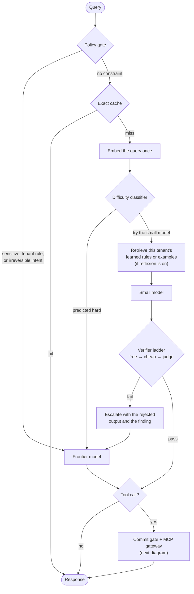
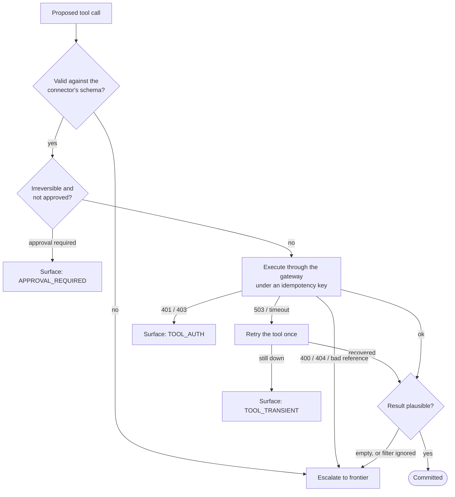
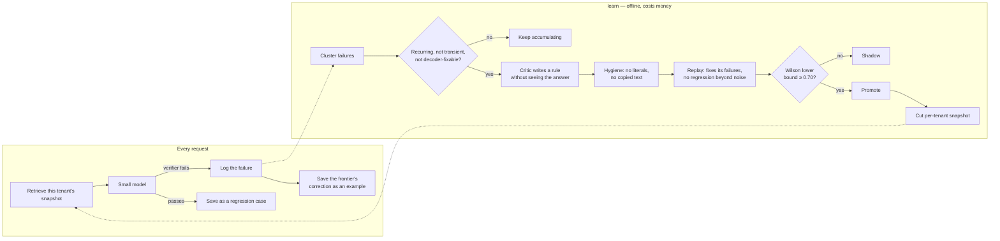

# smart-router

Cascading inference router with verifier-gated escalation.

Requests go to a small, cheap model first. Its output is checked by a ladder of verifiers
ordered by cost, and only when verification fails does the request escalate to a frontier
model — carrying the rejected attempt and the verifier's finding with it. Tool calls go
through a single MCP gateway behind a two-phase commit gate, so nothing reaches a live
connector unchecked. An optional reflexion loop learns from escalations offline.

The design rationale (`IMPLEMENTATION_PLAN.md`) and the requirements it answers
(`AGENT_PROMPT.md`) are kept outside this repository.

## Status

**Built and tested:** the routing path (policy gate, exact cache, difficulty classifier,
cost-derived threshold), the three-tier verifier ladder, the two-phase commit gate with
MCP tool execution (including a live stdio gateway), and the reflexion loop with both of
its modes, behind a flag.

**Not built:** the evaluation harness that measures false-accept rate against ground
truth; a multi-step agent loop; frontier pinning for multi-turn sessions.

**Not measured:** no accuracy, cost or latency figures are claimed. Those need the
evaluation harness, a live provider and a labelled corpus. Unit tests run against mock
models.

## How it works

### Request flow



- **Policy runs first and costs nothing.** Sensitive content, frontier-only tenants and
  irreversible intent can skip the small model entirely.
- **One embedding is shared** by the classifier and memory retrieval. It's computed only
  when one of them is enabled.
- **The classifier abstains until it has 200 labels**, which the cascade produces itself:
  every escalation is a negative example and every verified pass a positive one. Until
  then, everything that clears policy tries the small model.
- **The threshold comes from cost**, not a hand-tuned confidence. The small model is tried
  when `P(fail) × (cost_small + cost_frontier + cost_of_being_wrong) < cost_frontier`, and
  `cost_of_being_wrong` is set per risk class (read-only, reversible write, irreversible
  write).
- **If the small model's provider times out, it's retried once.** If it fails again, the
  frontier is a genuine fallback — a different provider can answer. A tool that's down is
  different; see below.
- **Prompt order is fixed for the provider's prefix cache:** system, tools, tenant
  context, then conversation history (all stable), then retrieved memory and the current
  turn (volatile). Memory is never placed in the system prompt, and never saved into the
  history.

### Verifier ladder

| Tier | Checks | Catches | Misses |
| :-- | :-- | :-- | :-- |
| **Free** | truncation, refusal, JSON, tool call against the connector's schema | structural errors — most of which constrained decoding would prevent outright | anything well-formed but wrong |
| **Cheap** | token logprobs (when the endpoint exposes them), self-consistency | an uncertain model | a confidently wrong one: 3/3 agreement on a wrong answer passes |
| **Judge** | an LLM compares the request with the proposed action | semantic mismatches, e.g. cron `0 8 * * *` for "weekday mornings" | — (the expensive tier) |

The ladder stops at the first failure. **The judge runs on every irreversible call and on
a random 2% of everything else**: the first protects, the second measures how often the
cheaper tiers are fooled. Use a mid-tier model as the judge. With a frontier-priced judge,
the small model has to pass it roughly 74% of the time just to break even.

### Tool calls and failures

Every MCP server sits behind one gateway. The gateway's `list_tools()` fills a single
registry, and that registry supplies the prompt's tool block, the constrained-decoding
schema and the validator, so the three can't disagree.



| Outcome | Example | What happens | Frontier paid? |
| :-- | :-- | :-- | :-- |
| Invalid payload | `max_results: "ten"`, invented operator, missing field | Rejected before the server is contacted; escalated with the exact path that failed | yes |
| `TOOL_TRANSIENT` | 503, timeout, connection reset | Tool retried once; if still down, returned to the caller | no |
| `TOOL_SEMANTIC` | 404, bad ref, malformed query | Escalated with the gateway's own error text | yes |
| `TOOL_AUTH` | 401, 403 | Returned to the caller; no retry | no |
| `APPROVAL_REQUIRED` | irreversible call without approval | Returned to the caller; nothing sent | no |
| `TOOL_RESULT_SUSPECT` | empty result, filter silently ignored | Escalated | yes |

- **Only the small model's failures escalate.** When the frontier's own tool call fails,
  it's returned to the caller — there's no tier above it. Policy-forced and predicted-hard
  requests go through the same gate.
- **Validation is recursive**, so a wrong field three levels inside a nested filter is
  caught before the connector sees it.
- **Tools that don't declare whether they're reversible are treated as irreversible.**
  Inference from the tool name (`git_push`, `send_mail`) is a safety net, and
  `ToolRegistry.audit()` lists every guess for someone to confirm.
- **Irreversible calls get a dry run first** where the gateway supports one. MCP has no
  dry-run, so for live MCP servers use `require_approval_for_irreversible` instead.
- **Non-HTTP servers are classified from their error text.** git reports exit codes and
  prose rather than status codes. The default classifier handles common git and network
  wording; other servers may need their own.

### Reflexion (optional)



That diagram is `rules` mode. In `exemplars` mode, `learn` skips distillation and simply
serves the saved corrections as few-shot examples.

- **Nothing learned reaches traffic until `learn` has run.** A rule with a perfect 8/8
  replay still stays in shadow: its Wilson lower bound is 0.68.
- **Each tenant gets its own snapshot.** One tenant's learned text can't reach another
  tenant's prompt, because it's never in the set being searched. Examples are never
  shared across tenants.
- **Snapshots are content-addressed**, and the version is logged on every request, so a
  request can be replayed against exactly the memory it saw.

## Install

```bash
uv venv && uv pip install -e '.[dev]'
```

Optional extras: `providers` (LiteLLM), `mcp` (live MCP servers), `embed` (local
sentence-transformers). The core runs and tests with none of them; `MockClient` and
`HashingEmbedder` are the defaults.

## Run

```bash
.venv/bin/python -m smart_router.demo               # cascade + verifier ladder
.venv/bin/python -m smart_router.tools.demo         # tool failure paths
.venv/bin/python -m smart_router.memory.demo        # offline reflexion loop
.venv/bin/python -m pytest -q
```

## Testing against live models

```bash
uv pip install -e '.[dev,providers]'
export GEMINI_API_KEY=...                  # or GOOGLE_API_KEY

# 1. Find real model ids (litellm's list lags provider releases)
.venv/bin/python -m smart_router models --filter gemma

# 2. What do these endpoints actually expose?
.venv/bin/python -m smart_router probe \
    --small gemini/gemma-4-31b-it \
    --frontier gemini/gemini-3.1-pro-preview

# 3. Run the cascade. Pass pricing from the provider's current price list.
.venv/bin/python -m smart_router route \
    --small gemini/gemma-4-31b-it --small-in 0.10 --small-out 0.30 \
    --frontier gemini/gemini-3.1-pro-preview --frontier-in 2.00 --frontier-out 12.00 \
    --query "Summarise what a cascading inference router does, in three bullets."
```

Run `probe` first. It checks whether each endpoint returns logprobs, honours
constrained decoding and reports cached tokens. Without the first two, half the verifier
ladder doesn't exist; without the third, cost numbers can't be verified. Add
`--small-logprobs` / `--small-constrained` to `route` once the probe confirms them, and
`--judge <mid-tier id>` to turn on the judge.

Pricing is a command-line argument rather than a constant, because rates change and
differ by region and tier.

## Testing against a live MCP server

`mcp-server-git` is the cheapest real target: local, no auth, and its failures are exit
codes and prose rather than HTTP statuses, which is what exercises the gateway's error
mapping.

```bash
uv pip install -e '.[dev,mcp]'
.venv/bin/python -m pytest -m live_mcp -q      # spawns the server via uvx
```

Point `--repository` at a throwaway repository before trying anything that writes.
`smart_router.tools.yantra_demo` runs the full path (git read → summary → drafted Webex
message refused for lack of approval) against a local clone.

## Reflexion flag

Off unless enabled, and inert when off: no embedding forced, nothing retrieved, no files
written.

```bash
# Serve with reflexion on (or: export SMART_ROUTER_REFLEXION=1)
.venv/bin/python -m smart_router route --reflexion --small <id> --frontier <id> --query "..."

# Offline: turn logged failures into rules
.venv/bin/python -m smart_router learn --small <id> --frontier <id> --judge <mid-tier id> --embedder st

# What has been stored
.venv/bin/python -m smart_router reflexion-status
```

| Setting | Flag | Environment | Default |
| :-- | :-- | :-- | :-- |
| on / off | `--reflexion` / `--no-reflexion` | `SMART_ROUTER_REFLEXION=1` | off |
| mode | `--reflexion-mode rules\|exemplars` | `SMART_ROUTER_REFLEXION_MODE` | `rules` |
| state | `--reflexion-dir DIR` | `SMART_ROUTER_REFLEXION_DIR` | `.smart_router/reflexion` |

Flags override the environment. Both modes save the same data, so you can switch later
without starting over.

**Before relying on it:**
- **`learn` costs money.** Replay re-runs the small model twice per saved regression
  case for each candidate rule, plus a judge call each time when `--judge` is set.
- **Use `--embedder st`.** The default hashing embedder only matches shared words, and the
  hygiene filter stops a rule from reusing its source query's words — so with the default,
  learned rules rarely match new queries.
- **Semantic failures need `--judge`.** Replay always runs the judge, because a failure
  only the judge can see would otherwise look fixed with or without the rule.

```python
from smart_router.memory.reflexion import Reflexion, ReflexionConfig

reflexion = Reflexion(ReflexionConfig.from_env(), embedder)      # off unless enabled
router = SmartRouter(..., embedder=embedder, reflexion=reflexion)
reflexion.learn(router, critic_complete=critic.complete, live_model=small_id)
```

## Layout

```
cli.py, __main__.py      command line: models · probe · route · learn · reflexion-status
probe.py                 what an endpoint exposes: logprobs, constrained decoding, cached tokens
prompt.py                prompt assembly in prefix-cache-safe order
embed.py                 local embedding: hashing (default) or sentence-transformers
vectors.py               in-memory vector snapshots with MMR; no vector database
telemetry.py             measured cost, latency and cache accounting
cache/exact.py           exact-match response cache, keyed by tenant and model

gateway/                 LLM providers
  base.py                client protocol and provider errors
  client.py              LiteLLM client
  mock.py                scriptable client for tests; simulates prefix caching
  model_config.py        per-model pricing, timeouts and capabilities

routing/
  router.py              the request lifecycle
  policy.py              deterministic policy gate and risk classes
  classifier.py          difficulty classifier trained on the cascade's own labels
  threshold.py           routing threshold derived from cost

verify/
  free.py, cheap.py      structural and probabilistic verifiers
  expensive.py           LLM judge and its sampling policy
  ladder.py              ordering, short-circuiting, failure decomposition
  result.py              checks on what a tool returned

tools/
  gateway.py             MCP gateway protocol, mock and composite gateways
  stdio_gateway.py       live MCP servers over stdio
  registry.py            single source of truth for tool definitions
  schema.py              recursive validation of nested tool arguments
  reversibility.py       fail-safe inference for undeclared tools
  errors.py              tool error taxonomy, separate from provider errors
  commit.py              two-phase commit gate: propose → verify → commit

memory/
  reflexion.py           the flag: config, persistence, per-tenant retrieval, learn()
  failures.py            failure log and clustering
  gate.py                suppression gate
  critic.py              rule synthesis, blind to the frontier's answer
  hygiene.py             anti-memorization filters and secret scrubbing
  replay.py              resolution, regression and set-level replay
  lifecycle.py           Wilson bounds, label bias, rule states
  store.py               rule store and snapshots
  retrieval.py           top-k, MMR, token budget, similarity floor
  exemplars.py           the examples arm
  loop.py                the offline loop end to end

schemas/
  routing.py             routing decision, route tiers, risk classes
  verification.py        verifier results and the failure taxonomy
  rule.py                learned rule, provenance, lifecycle states
  trace.py               per-request trace consumed by telemetry
tests/
```

## Known limitations

- **Not an agent loop.** The router handles one request at a time; it doesn't plan across
  tool calls. Multi-step tasks need a layer above it.
- **Multi-turn escalation inherits the small model's history.** When turn 5 escalates, the
  frontier sees turns 1–4 as the small model wrote them. Pinning a session to the frontier
  after its first escalation is a recommendation, not a feature.
- **Frontier output isn't put through the verifier ladder.** Its tool calls are validated
  by the commit gate; its prose is trusted.
- **Verifier-pass is a proxy label.** Every confidence figure in the reflexion loop
  measures "passes our checks", not "is correct". `LabelBiasEstimate` can discount it
  once you have an audited sample; until then, treat the numbers as optimistic.
